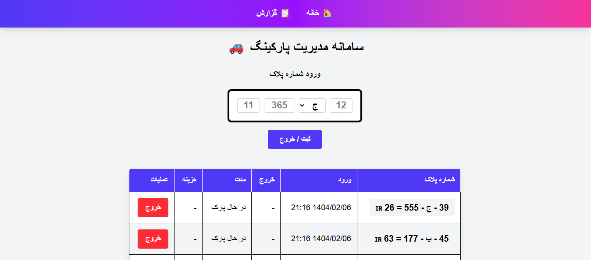
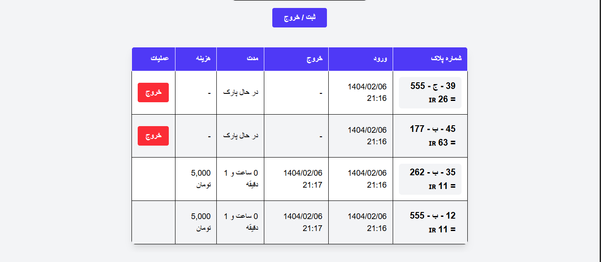
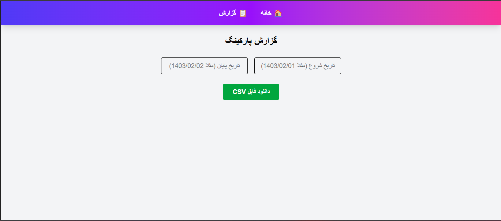

# 🅿️ Parking Management System (پارکینگ منیجمنت)

A professional parking management web application built with:

- ⚡ Next.js (React + Vite Starter)
- 🎨 TailwindCSS for modern design
- 🇮🇷 Persian (RTL) support
- 🗓 Jalali (Shamsi) date using Moment-Jalaali
- 💾 CSV report download
- 💸 Automatic parking fee calculation

---

## ✨ Features

- ✅ Persian RTL layout
- ✅ Login system
- ✅ Add/exit car plates
- ✅ Real Iranian plate format (two-part numbers + letter + city code)
- ✅ Entry and Exit time recording (Jalali Calendar)
- ✅ Parking duration calculation (hours + minutes)
- ✅ Parking cost calculation (5,000 Toman per hour)
- ✅ Download filtered parking reports (CSV)
- ✅ Responsive and mobile-friendly
- ✅ Beautiful animated navigation

---

## 📸 Screenshots

| خانه (Dashboard) | اضافه کردن پلاک | گزارش دانلود | ورود (Login) |
|------------------|-----------------|--------------|--------------|
|  |  |  |  |

---

## 🚀 Getting Started

First, install all dependencies:

```bash
npm install
```
```bash
npm run dev
```
```bash
Open http://localhost:3000 in your browser to see the app.
```
## 📂 Folder Structure
```bash
parking-management/
├── public/
│   └── Screenshot (60).png
│   └── Screenshot (61).png
│   └── Screenshot (62).png
├── src/
│   ├── components/
│   │   ├── LoginPage.tsx
│   │   ├── Dashboard.tsx
│   │   ├── PlateForm.tsx
│   │   ├── CarsTable.tsx
│   │   └── ReportPage.tsx
│   ├── types/
│   │   └── Car.ts
│   ├── utils/
│   │   └── date.ts
│   ├── index.tsx
│   ├── App.tsx
│   └── index.css
├── README.md
└── package.json
```
## 🧠 Future Improvements

- 📅 Add Persian Jalali Datepicker (better user experience for date picking)
- 💾 Save cars in localStorage (so data remains after refresh)
- 🖨️ Add print version of report (easy paper print for parking office)
- 👨‍💼 Admin panel for multiple users (different login levels)
